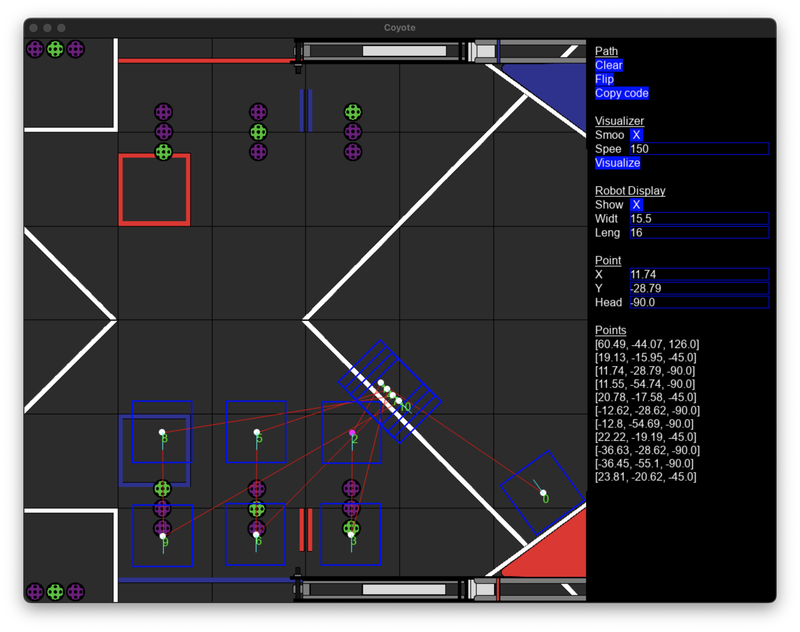

# Coyote
Coyote is a simple GUI-based tool to generate autonomous paths for FTC 
robotics. It can generate Java code from the paths generated.


## Usage
To run Coyote directly, clone this repository, navigate to the directory, 
and run the following:
```bash
python3 main.py
```
To use Coyote, run the app and create your path. **Coyote's points use 
inches**. Then, press "Copy code" to copy the Java code for the path to the 
clipboard. The code will be in the following format:
```java
odo.setPosition(new Pose2D(DistanceUnit.INCH, {}, {}, AngleUnit.DEGREES, {}));

runtime.reset();
while (opModeIsActive() && runtime.seconds() < 5.0) {
    moveRobotTo({}, {}, {});
    telemetry.addData("Leg {}: ", runtime.seconds());
    telemetry.update();
}
...
```
The code generator expects the odometry computer to be named `odo` and a method
`moveRobotTo` to be implemented by the user that will move the robot to a
position (e.g. PID-to-position / RoadRunner / PedroPathing). It also generates 
each leg to be 5.0 seconds **(you should definitely change this)**. An example 
OpMode is provided in [examples](examples).

## Building
To install the needed dependencies, run the following in your favorite terminal
emulator:
```bash
python3 -m pip install -r requirements.txt
```
Then, run this to build the app using cx-Freeze:
```bash
python3 setup.py build
```
The executable will be somewhere in the `build` directory.

## Credits
- Team Juice 16236 for FTC DECODE field image

